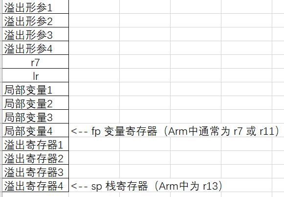

*说明：文档中没有加 LIR 前缀的均为中端数据结构*

### LirModule

---

[LirModule](../include/LIR/visitor/LirModule.h)
`LirModule` 类，为中端 IR 的简单映射，同样包含 `GlobalVars`,`FunctionDefs`, 但是没有 `FunctionDeclares` ？其函数的定义与声明在汇编层面为何有此区别？
> 汇编中 Call 某个函数直接使用 bl + \<label\> 即可，即只需要 FunctionDeclares 的函数名，不需要带有其他信息（但其他信息在构建 LIR 中的 `LIRCall` 会用到）。

### LirFunction

---

[LirFunction](../include/LIR/visitor/LirFunction.h)
`LirFunction` 类，包含参数（但是这里会考虑到实际的寄存器数量的限制）,局部变量的栈空间大小 `stackSize`。

#### 栈帧结构图
如图为栈空间结构：

> 
> * 溢出形参： `LirFunction` 的形参数目超过预设的形参寄存器时，溢出到栈空间的形参（注意，Arm 汇编输出时，`LirFunction` 的默认 `codeGen` 模式为首先 `push {r7, lr}`，将本 `LirFunction` 记为 `Callee`，调用本 `LirFunction` 的 `LirFunction` 记为 `Caller`，则溢出形参在 `Caller` 中压栈）
> * 局部变量：即本 `LirFunction` 中的局部变量
> * 溢出寄存器：经过寄存器分配后，溢出的虚拟寄存器存储在栈空间中

#### LirFunction 重要变量
`stackSize`：函数的栈变量空间大小，只可能为 一部分 或 三部分 组成。（在没有溢出形参时只需考虑局部变量）
  1. 溢出到栈中的形参（超过了预留的形参寄存器上限）
  2. 局部变量
  3. 为 push {r7, lr} 预留的空间（其中，如果本 LirFunction 没有调用 call 指令，不必 push lr，但迫于时间，先统一 push）

`immMap<LirOperand, LirInstMove>` : 对于 `Imm` 而言，一个 `Imm` 即意味着两条 `mov` 语句 (`movw` 与 `movt`)，将立即数值拷贝到 `reg` 中。
`stackOffsetMap<Value*, IImm>`：临时变量，`alloca` 产生的局部变量对应的栈上偏移。


### LirInst

---

Lir 中的指令，与中端 IR 类似，包含有：
  * 所属基本块： `LirBlock *parent`
  * 指令的类型： `LirInstKind lirKind`
  * 侵入式链表结点 `INode<LirInst>`

**LirBinary**

### LirOperand

---

Lir 中的操作数，有如下的几种类型

**Addr**
arm 中的地址标签

**Reg**
arm 中实际会分配的寄存器
  * **IVReg**
    虚拟整数寄存器，由于无限寄存器假设，故从零开始编号.(不过是否是不同 Function 可以同号？)
  * **FVReg**
    虚拟浮点寄存器
  * **IPhyReg**
    未知
  * **FPhyReg**
    未知

**Imm**
float 立即数与 int 立即数
  * **IImm**
    int 立即数
  * **FImm**
    float 立即数

### ToLir

---

实现了从 SSA IR 到 LIR 的转换。

以下变量为 ToLir 转换所需的工具：
* `valMap` 包含 IR 值到 `LirOperand` 的映射，即将 IR reg 变到 LIR reg。
* `funcMap` IR 函数到 LIR 函数的映射
* `blockMap` IR 基本块到 LIR 基本块的映射
* `globalMap` IR 全局变量到 `LirOperand` 的映射

以下函数的作用：
#### 键值绑定函数
* `bindValue` 将中端 IR `Value` 值，和当前其对应的 `LirOperand` 绑定，放入 `valMap` 中，`valMap` 是不会更新同一个 `Value` 对应的键值的，因为是静态单赋值，绑定的原因是，如果后面的指令有使用到此 `Value`，则直接以这个 `LirOperand` 作为源寄存器即可。
```llvm
%b_ptr = getelementptr inbounds [2 x i32], ptr @_gimc_b, i32 0, i32 1
%b_1 = load i32, ptr %b_ptr
store i32 6, ptr %b_ptr
%b_2 = load i32, ptr %b_ptr
```
上述的 llvm 代码，也就是 IR 中端，会为 `%b_ptr`, `%b_1` , `%b_2` 分别分配一个虚拟寄存器 `IVReg`，而第 2，3，4 条指令均使用了 `%b_ptr`，假设经过 `bindValue` 后绑定的虚拟寄存器为 `b_ptr_virtual_reg`，在解析中端 IR 时，会把 `%b_ptr` 平滑替换为 `b_ptr_virtual_reg`.

* `bindGlobal` 将三类全局符号与 `Addr` 类型绑定。全局符号有
  * 全局变量标签：`.global`
  * 函数标签：`<function name>:`
  * 基本块标签：`<block name>_<function name>:` 基本块名后加函数名，使得其值唯一。

* `getBindOperand` 
  * 从 `valMap` 和 `globalMap` 中获得除了 IR 中 `alloca` 指令分配的局部变量外的所有虚拟寄存器。
  * 对于 `alloca` 出来的变量，（也只有 `alloca` 出来的变量和溢出的形参能存在栈空间上），函数解决了获取栈上变量的功能。
> 如何获取的栈上变量？
> 1. 先判断是不是栈上变量：若中端 `Value` 与 `IImm` 绑定（在 `LirFunction` 的 `stackOffsetMap` 中），说明其在栈上。
> 2. LIR 中新增一条 `add` 指令，将实际的栈上位置存入寄存器，再加一条 `ldr` 指令，将栈上值存入寄存器中。

#### 栈分配
* `dealAlloca`

* `operandResolve` 函数：
将 `operand` 解析为 `Imm` 或 `Reg`
  * 对于 `ConstValue`,解析为 `Imm`
  * 对于浮点类型的 `Value`，解析为 `FVReg`，（因为指针也使用通用寄存器的缘故）

#### moduleGen
`moduleGen` 函数：
  * 对于全局变量，新建一个地址（`Reg` 类型为 `Addr`）即可，例如一个全局变量 `a`，它被用到时直接用 `move` 放到寄存器即可。
  * 对于 `Function`
    * 函数形参的处理：可以考虑拿一部分整数和浮点寄存器出来（4,16 个为上限）存放形参，剩下的放入栈中。
    * 函数体的处理（即每条指令的处理）
  * 对于 `BBlock`
    * 每个基本块需要将其中的局部变量清空。（因为从数据流的哪一方来的不确定，不能严格地说某个虚拟寄存器中的值一定为栈中变量的值。*PS：引入 **Phi** 或许也是想根据数据流选择其他 BBLock 的寄存器*）

#### instResolve
**二元运算指令**
相应的 LIR 数据结构为 `LirBinary`

以 `Add` 指令为例子：
  * 判断左操作数是否为常数，否则左右换位（由于 armv7 要求左操作数必须为寄存器）【是否应该考虑左右两边均为常数的情况？】
  * 将左右 `Value` 解析为两个操作数，`Add` 指令本身作为目的操作数。
  * 最后创建二元运算指令，将指令加入 `LirBlock` 的侵入式链表中。

**Alloca**
LIR 实际上不需要这条指令了。

`alloca` 指令分配了一片内存空间，内存空间的首地址为其 `ptr` （实际上是通过 `alloca` 重建符号表的过程），它当然不属于一个会被分配寄存器的值。（只有 `load` 才能将内存空间的值取出来，实际分配为 `reg`）

如此一来，只需要在 `LirFunction` （因为栈偏移是函数的一个成员变量）中维护一个 `<Value*, IImm>` 的映射 [stackOffsetMap](#LirFunction-重要变量)，因为后续的 `store` 和 `load` 操作均为访存操作。只需要获得在栈上的位置即可。

**Store**
相应 LIR 数据结构为 `LirStore` 可以平滑翻译到 `ldr` 指令。即将 `Reg` 的值复制到栈内存。

**Load**
相应 LIR 数据结构为 `LirLoad` 平滑翻译到 `str` 指令，即将栈内存值复制到 `Reg`

**Call**
相应 LIR 数据结构为 `LirCall`

`Call` 的实际处理：中端中 `Call` 是对于函数的调用，需要处理参数的传递，根据所调用的 `Function` 的参数数目，将其存入参数寄存器或栈空间。
对于 arm 汇编，我们需要将参数存入预定好的几个寄存器中，参数超过寄存器上限时溢出到栈中。
那么在 LIR 中，一条中端 `Call` 指令会产生 n 个 `Reg`，其中 n 为形参个数，显然，在 `LirCall` 也必须包含调用的 `Function` 的名字（只需要函数名即可）。

**Ret**
arm 汇编中为函数的退出操作，考虑到可能有多个 Ret 的情况，遵循这样的原则：进入函数 push 了哪些，出函数就要 pop 哪些寄存器。
  * lr 除外，对于 lr 压栈的情况，需要将函数开始时 push 进 lr 的值 pop 到 pc
  * 如果没有 push lr，则说明本函数中途没有用到 `Call` 指令，lr 寄存器一般为保留，故而 lr 为上一个函数的值。（现在默认会 push lr，不考虑这种情况）

在中端 IR 中，`Ret` 语句还会具有返回值，在 arm 汇编中返回值被放在 r0 寄存器，故 LIR 只需要记录返回值的 `Reg` 即可。

**Icmp** 与 **Fcmp**
在 arm 汇编中，`cmp r, op2` 语句是将 `r` - `op2` 的结果存到 CSPR 状态寄存器中。
则 LIR 需要的即为两个输入 `Reg`。无输出 `Reg`。（实际上为状态寄存器）

**Br**
中端中的 `Br` 包含了有条件跳转与无条件跳转，相应的 LIR 数据结构为 `LirBr`.

对不同的 CMP KIND（均为有符号相比）有相应状态 `<cond>` :EQ，GT，GE，LT，LE，NE.

在 arm 汇编中，有条件跳转是两条 arm 指令 `b<cond> + <label>(false)` 和 `b + <label>(true)`。无条件跳转即为 `b + <label>`

在 LIR 中，我们只需要将 Br 加入指令集，且保证使用 Br 的有条件跳转之前的那条指令，一定是一条 `cmp` 指令（这个在 IR 中也应当保证，优化时不能改变其顺序）

**GEP**
中端 IR 中的 GEP 指令就是将数组降低维数，放在 arm 汇编中就是 `offset * 该维度 length`. llvm 中的 GEP 指令让人摸不着头脑。现在考察我们的 GEP 指令。
* `is_param` 参数表示是否为形参。
  * `true`: GEP 指令对应的 `baseTypePtr` 是其所取数组本身。
  * `false`: GEP 指令对应的 `baseTypePtr` 是其所取数组的基类，在 [example.cpp](../IR/example.cpp) 中的 eg.6 中，局部变量 eg6_c_ptr 是指向 4 * 2 个 int 区域大小的指针。（则它 getType().getSize() 返回的大小为 8 * 4 B）
实践中出真知，等开始测验时再 debug 看看到底如何偏移。

感谢前端，实现了 GEP 指令的类型正确，对于数组只需要进行 `type.getSize() * offset + baseAddr` 就可计算出偏移量了。

在 LIR 中，假设我们在 GEP 指令中得到了
  1. **形参** 的指针 `ptr` 及其偏移量 `offset`
    容易得知此 `ptr` 由于其指向的内存不是在本函数内生成的（区别于局部变量），所以便没有一个映射表，而是要将此 `ptr` 的实际值存入 `Reg` 中，将其与 `offset` 相加，则又得到一个最终的 `Reg`
  2. **局部变量** 的指针 `ptr` 及其偏移量 `offset`
    根据 `LirFunction` 中的 `stackOffsetMap` 获得变量在函数中的栈偏移值 `varOffset`，存入 `Reg`，并与 `offset` 值相加存入最终 `Reg`。
  3. **全局变量** 的指针 `ptr` 及其偏移量 `offset`
    首先将标签值 `ptr` 存入 `Reg`,将其与 `offset` 相加得到最终的 `Reg`

**Fp2Int** 与 **Int2Fp** 与 **Zext**
以 `Fp2Int` 为例子
很简单，只需要将装 fp 的 freg 换成 vreg 就行了。一个 src 和 dst
对 `Zext` 采用 `Move` 指令，因为在 arm 汇编中，cmp 结果保留在状态寄存器中。（根据此要求，中端 IR 和 LIR 需要保证 `Zext` 前一定是一条 `Icmp` 或 `Fcmp` 指令）

**LirMove**
此条指令为转移寄存器的值或将立即数转移到寄存器中，需要 `dst` 和 `src`

**InitMem**
此条是为了方便转换使用的将数组置为零的指令，

### Arm 汇编

---

`vldr` 指令，从文本池中加载任何 64 位整数、单精度或双精度浮点值。

### 优化

---

#### 寄存器分配——栈分配（baseline）
首先考虑基础的栈分配：对于 `alloca`,`load`,`store` 和 `gep` 指令，对应于栈上偏移即可。对于其他的所有运算指令，为每次产生的新的 `dst reg` 分配一个栈空间。跳转指令和 `cmp` 指令等不产生新寄存器的指令不分配栈空间。
* 或许可以有第二种做法，即 LIR 均按照无限寄存器进行构造，但是，可分配的寄存器只有两个，且采用栈分配的方式，将每一个 `reg` 放入 `stack`.

~~一想到用 SSA 做栈分配，比用 AST 的性能可能还差，心里接受不了......~~

从进入 `LirFunction` 开始：
* 考虑栈初始化后，即现在栈中拥有如 [栈帧结构图](#栈帧结构图) 所示，但 `sp` 与 `fp` 指向同一个栈地址，即溢出寄存器数目为 0.
* 将 LIR 中的二元运算指令，`Fp2Int` 指令，`Int2Fp` 指令产生的 `dst` 寄存器，当作一个变量来处理。类似于 LIR 搭建时为 `alloca` 出的变量绑定栈偏移值，同样的这里也为他们设置栈偏移值。
* 二元指令中的 `IVReg` （虚拟寄存器），替换为 `r4` 或 `r5`，结果存到 `r4`.再压栈；`RVReg`，替换为 `s16`, `s17`，结果存到 `s16`，再将其压栈
* `Fp2Int` 将 `s16` 值转换到 `r4`，压栈；`Int2Fp` 将 `r4` 值转换到 `s16`，再压栈，即可。